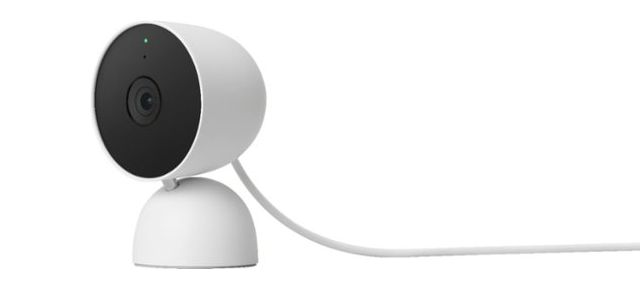

# Nest v2 web dashboard
### Summary
The new Nest Cameras are incompatible with the Nest web interface.
Users are required to use the Google Home app from their mobile device.
This leaves users like myself unable to view the new nest cameras from the desktop.
The google team has promised to have a [web interface ready](https://www.googlenestcommunity.com/t5/Blog/Message-from-our-GM-Updates-for-our-Nest-customers/ba-p/17122) for over 2 years without any details on timelines or ETA.

### Solution:
Nest and Google have a number of APIs available.. lets see if I can roll my own dashboard.

### Tasks:
[x] Get documentation on APIs Access Needed for viewing camera feeds.
[] Mock version of camera dashboard interface.
[] Integrate API services with dashboard.
[] Test interface / monitor usage limits ...
